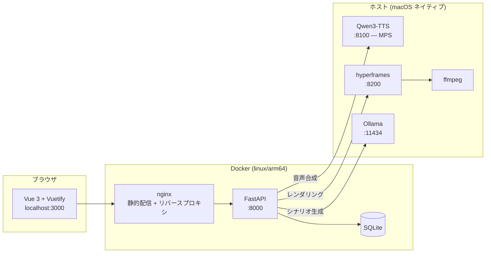

# AI-MovGen — 研修動画の自動生成ツール

PowerPoint やテキストから、**ナレーション音声付きのスライド動画**を自動生成する
ローカル完結型の Web アプリケーションです。

シナリオの構成・原稿の執筆・音声合成・スライドのデザイン・動画のレンダリングまでを
一貫して行います。**文章生成も音声合成もすべてローカルで動作**するため、
資料や原稿が外部のサービスに送信されることはありません。

> **⚠️ このリポジトリはソースコードの公開のみを目的としています。**
> ライセンスは設定していません（詳細は[ライセンス](#ライセンス)を参照）。

---

## 目次

- [できること](#できること)
- [構成](#構成)
- [動作要件](#動作要件)
- [セットアップ](#セットアップ)
- [起動と停止](#起動と停止)
- [使い方](#使い方)
- [設定](#設定)
- [トラブルシューティング](#トラブルシューティング)
- [コミットと公開](#コミットと公開)
- [ディレクトリ構成](#ディレクトリ構成)
- [ライセンス](#ライセンス)

---

## できること

### 3 通りの入力からシナリオを作る

| 入力 | 説明 |
| --- | --- |
| **PPTX 取り込み** | 既存の研修資料を読み込み、スライドごとにシーンを起こす。図表は画像として抽出して配置する |
| **テキスト貼り付け** | 台本や記事を貼り付けて、AI に構成へ分解させる |
| **AI チャット** | 「〇〇の研修動画を作って」と対話しながら構成を組み立てる |

### スライドを 10 種類のレイアウトで描き分ける

`section_header`（章扉） / `bullet_list`（箇条書き） / `comparison`（対比） /
`card_panel`（カード） / `table`（表） / `graph_chart`（グラフ） /
`chat_dialog`（会話） / `image_gallery`（画像一覧） /
`text_left_image_right`（左右 2 段） / `full_image`（全面画像）

内容に応じて AI がレイアウトを選び、HTML と CSS を生成します。
生成結果はエディタで直接手直しできます。

### ナレーションを声質クローンで読み上げる

Qwen3-TTS により、用意した参照音声の声質でナレーションを合成します。
話者を 2 人設定すれば、掛け合い形式の会話シーンも作れます。

### デザインを設定で切り替える

配色 5 色・書体・**背景モチーフ 6 種**・**装飾スタイル 4 種**・
**組版 3 段階**・**シーン切替 5 種**を組み合わせられます。

背景色の明るさから明暗テーマを自動判定し、文字色・境界線・影などの派生色を
自動的に整合させます。文字色と背景色のコントラストが不足する場合は、
読める色へ自動補正します。

完成形のプリセットを 8 種類同梱しています。
「落ち着いた和風にして」のような指示から AI にデザイン一式を提案させることもできます。

---

## 構成



**なぜ TTS とレンダラーだけホスト側で動かすのか**

- **TTS**: Apple Silicon の GPU (MPS) を使うため。コンテナからは GPU が見えない
- **レンダラー**: コンテナ内では GPU が無く SwiftShader にフォールバックして
  大幅に遅くなる（10 秒のコンポジションで 12.2 秒 → 5.1 秒の差を実測）

### 動画が組み立てられるまで

1. `composition.py` がシーン群から `index.html` / `style.css` / `meta.json` を書き出す
2. 各シーンの尺は**合成済み音声の実長**から決まる（原稿の文字数ではない）
3. GSAP のタイムラインを `data-start` / `data-duration` 属性から動的に構築する
4. hyperframes がヘッドレス Chrome でフレームを書き出し、ffmpeg が MP4 に変換する
5. 長い動画は分割してレンダリングし、最後に ffmpeg で無劣化連結する

---

## 動作要件

**macOS (Apple Silicon) を主に想定**しています。Linux でも動かせます（[Linux で動かす場合](#linux-で動かす場合)）。

- TTS は GPU を使う（Apple Silicon の MPS、または NVIDIA の CUDA。無ければ CPU で非常に遅い）
- レンダラーはホスト上のネイティブの Chrome（hyperframes）を使う
- 書体としてヒラギノ・游書体など macOS のシステムフォントも選べる（Linux では代わりの書体で表示される）

以下は macOS の場合です。

| 必要なもの | 用途 | 導入 |
| --- | --- | --- |
| macOS + Apple Silicon | — | — |
| Docker Desktop | Web アプリ本体 | [公式サイト](https://www.docker.com/products/docker-desktop/) |
| Python 3.10 以上 | TTS / レンダラー | `brew install python@3.12` |
| Node.js | hyperframes の実行 | `brew install node` |
| ffmpeg | 動画のエンコード | `brew install ffmpeg` |
| Ollama | シナリオ・デザインの生成 | [公式サイト](https://ollama.com/) |

メモリは 32GB 以上を推奨します（TTS モデル + ヘッドレス Chrome を
複数ワーカーで動かすため）。

---

## セットアップ

### 1. リポジトリを取得する

```bash
git clone <このリポジトリの URL>
cd <クローンしたフォルダ>
```

### 2. ホスト側の依存を入れる

**macOS の場合:**
```bash
brew install ffmpeg node python@3.12
npm install -g hyperframes
```

**Linux (Ubuntu / Debian) の場合:**
```bash
sudo apt update && sudo apt install -y ffmpeg python3-venv fonts-noto-cjk
npm install -g hyperframes
```

### 3. ローカル LLM を用意する

```bash
# Ollama をインストールしてからモデルを取得する
ollama pull qwen3:14b
```

別のモデルを使う場合は `.env` の `LOCAL_LLM_MODEL` で指定します。

### 4. TTS サーバーの仮想環境を作る

```bash
cd qwen3-tts
python3 -m venv .venv-host
source .venv-host/bin/activate
pip install -r requirements.txt
deactivate
cd ..
```

初回起動時に Qwen3-TTS のモデル（約 1.2GB）が `data/model_cache/` に
ダウンロードされます。

### 5. レンダラーの仮想環境を作る

```bash
cd mlx
python3 -m venv .venv-host
source .venv-host/bin/activate
pip install -r requirements.txt
deactivate
cd ..
```

### 6. 話者の参照音声を配置する

**この手順は必須です。** 声質クローンの元になる音声はリポジトリに含めていません
（実在する人物の声を含むため）。

```bash
mkdir -p engine/voice_samples/default
# 任意の音声を reference.wav として配置する
cp /path/to/your-voice.wav engine/voice_samples/default/reference.wav
```

- 形式: WAV / 5〜15 秒程度 / 明瞭な発話 / 背景雑音なし
- **必ず本人の音声か、利用許諾のある音声を使ってください。**
  他人の声を無断でクローンすることは避けてください
- 話者はアプリの「話者管理」から追加でき、ブラウザ上での録音にも対応しています。
  HTTP で運用していてブラウザのマイクを使えない場合は、録音ツールを使います（[話者を設定する](#3-話者を設定する)）

### 7. 環境変数（任意）

```bash
cp .env.example .env
```

すべて既定値があるため、既定のポートで動かす場合は設定不要です。

### Linux で動かす場合

macOS と同じく、TTS・レンダラーはホストで、Web アプリは Docker で動かします。
手順 3〜7 は同じです。違うのは次の点です。

- **Docker**: Docker Engine と Compose プラグイン
- **GPU**: NVIDIA の GPU とドライバがあれば、TTS は CUDA で動きます（`pip install -r requirements.txt` で CUDA 版の PyTorch が入ります）。無ければ CPU で動きますが、非常に遅くなります
- **ホスト側の依存**:
  ```bash
  sudo apt install ffmpeg python3-venv fonts-noto-cjk
  # Node.js（nvm など）を入れてから
  npm install -g hyperframes
  ```
  hyperframes が使うヘッドレス Chrome には、共有ライブラリ（libnss3 など）が要ります。足りないと起動時に表示されるので、hyperframes の案内に従って入れてください
- **arm64 の Linux**: hyperframes が取ってくる Chrome（Chrome for Testing）には arm64 の Linux 版がありません。ディストリビューションの Chromium を入れ、`.env` で指定します
  ```bash
  sudo apt install chromium        # 実行ファイルの場所は `which chromium` で確認
  # .env
  HYPERFRAMES_BROWSER_PATH=/usr/bin/chromium
  ```
- **Docker イメージ**: 形式（x86_64 / arm64）は固定していないので、そのマシンの形式で作られます
- **待ち受けアドレス**: Linux では、コンテナからホストの `127.0.0.1` に届きません。`.env` に次を書き、TTS・レンダラーを Docker のブリッジのアドレスで待ち受けさせます（コンテナからは `host.docker.internal` で届き、LAN には出ません）
  ```bash
  HOST_SERVICES_BIND=172.17.0.1
  ```
  ファイアウォール（ufw など）が Docker のブリッジからの通信を止めている場合は、8100・8200 番を許可してください
- **ファイルの所有者**: api コンテナは、`start.sh` が渡すホストのユーザーの UID/GID で動きます。root で動かすと、コンテナが作るフォルダ（`projects/` や `data/` の中）がホスト上でも root 所有になり、ホストで動くレンダラーが書き込めないためです。以前の版で作られた root 所有のファイルは、`start.sh` が起動時に自動で直します。`docker compose up` を直接使うとコンテナが root で動くので、必ず `start.sh` から起動してください
- **書体**: ヒラギノ・游書体など macOS の書体はありません。それらを選んだスタイルは代わりの書体（Noto CJK など）で表示されます。同梱の BIZ UDPゴシックはそのまま使えます
- **ローカル LLM**: Ollama・LM Studio などを使い、`.env` の `LOCAL_LLM_BASE_URL` で指定します

---

## 起動と停止

### 初回起動前の必須準備

`start.sh` はホスト側の TTS（音声合成）サーバーと動画レンダラーサーバーも一括起動します。  
**初回起動前**に、以下のホスト環境の準備を必ず完了させてください（[セットアップ](#セットアップ) 詳細参照）。

#### 1. ホスト側依存ツール（ffmpeg / hyperframes）の導入
動画のエンコードに `ffmpeg`、スライド描画に `hyperframes`（npm グローバル）が必要です。

- **Linux (Ubuntu / Debian)**:
  ```bash
  sudo apt update && sudo apt install -y ffmpeg python3-venv fonts-noto-cjk
  npm install -g hyperframes
  ```
- **macOS**:
  ```bash
  brew install ffmpeg node python@3.12
  npm install -g hyperframes
  ```

#### 2. TTS サーバーの仮想環境作成
```bash
cd qwen3-tts
python3 -m venv .venv-host
.venv-host/bin/pip install -r requirements.txt
cd ..
```

#### 3. レンダラーサーバーの仮想環境作成
```bash
cd mlx
python3 -m venv .venv-host
.venv-host/bin/pip install -r requirements.txt
cd ..
```

#### 4. 話者の参照音声を配置
声質クローンの基準となる音声（5〜15秒程度の明瞭な wav）を配置します。  
※ 未配置の場合は起動時に標準のダミー音声が自動生成されますが、好みの声質を再現するには実音声を配置してください。
```bash
mkdir -p engine/voice_samples/default
cp /path/to/voice.wav engine/voice_samples/default/reference.wav
```

---

### コマンド一覧

```bash
bash start.sh            # ビルドして一括起動
bash start.sh --no-build # ビルドを省略して起動
bash start.sh --logs     # 起動後にログを追跡
bash stop.sh             # 停止
```

`start.sh` は TTS・レンダラー・Docker コンテナをまとめて起動し、
すべてのヘルスチェックが通るまで待機します。

起動したら <http://localhost:3000> を開きます。

| ポート | サービス |
| --- | --- |
| 3000 | Web アプリ |
| 8100 | TTS サーバー（ホスト） |
| 8200 | レンダラー（ホスト） |
| 11434 | Ollama（ホスト） |

### 環境ごとの上書き（Traefik・サブパス運用など）

`start.sh` と `stop.sh` は Compose の標準の読み方で `docker-compose.yml` を読みます。
環境ごとに設定を変えたいときは、次のどちらかで上書きします。

- `docker-compose.override.yml` を置く（自動で重なります。git の管理外）
- `.env` の `COMPOSE_FILE` で、使うファイルを並べる

#### Traefik の後ろに置く（サブパス運用・サブドメイン運用）
ホストの 3000 番を開けずに、Traefik のリバースプロキシ経由でサービスを公開できます。  
サブパス配下（例: `http://ct-studio.ofc.ct-net.co.jp/ai-mov-studio`）で公開する場合は、`.env` に以下を設定します：

```bash
APP_HOST=ct-studio.ofc.ct-net.co.jp
BASE_PATH=/ai-mov-studio
APP_URL=http://ct-studio.ofc.ct-net.co.jp/ai-mov-studio
TRAEFIK_NETWORK=traefik
TRAEFIK_ENTRYPOINT=web
```

`docker-compose.override.yml` が置かれている場合、`start.sh` は自動的に override を重ね、フロントエンドをサブパス対応でビルドして起動します。

> **注意**: このアプリにはログイン機能がありません。URL を知っている人は誰でも
> 動画の生成・削除や設定の変更ができます。閉じたネットワークで使い、外に出す場合は
> Traefik 側で認証や IP 制限を掛けてください。

起動の最後に表示する画面の URL は、`.env` の `APP_URL` で変えられます。
起動の確認は webapp のコンテナの中から行うので、URL やポートの設定には左右されません。

---

## 使い方

### 1. プロジェクトと動画を作る

ホーム画面でプロジェクトを作成し、その中に動画を追加します。

### 2. シーンを作る

「シナリオ」タブで、PPTX 取り込み・テキスト貼り付け・AI チャットの
いずれかから構成を作ります。生成後は各シーンの原稿・レイアウト・
画像を個別に編集できます。

### 3. 話者を設定する

「話者」タブで、ナレーションを読み上げる話者を選びます。
話者は「設定」画面の「話者管理」で、参照音声をアップロードするか、録音して登録します。
会話形式のシーンでは話者を 2 人設定できます。

#### 録音のしかた

| 方法 | 使える環境 | 手順 |
| --- | --- | --- |
| 画面上で録音 | `http://localhost:3000` か HTTPS でアクセスしているとき | 「音声収集セッションで作成」から録音する |
| 録音ツール | どこからでも（HTTP で運用していて、ブラウザのマイクを使えないときもこちら） | 下記 |

ブラウザは、HTTPS か localhost でないページにはマイクを使わせません。
HTTP で運用している場合は、録音ツールを使ってください。

1. 「話者管理」の **録音ツールをダウンロード** で HTML ファイルを保存する
2. そのファイルを **Google Chrome または Microsoft Edge** で開く
   （Safari は、ダウンロードしたファイルからマイクを使えません）
3. 収録モードと本数を選んで録音し、最後に名前を付けて **収録データ（.zip）** を保存する
4. 「話者管理」の **収録データを取り込む** でその zip を選ぶと、収録音声ライブラリに登録され、
   続けて話者を作成できる

録音ツールはサーバーと通信せず、パソコンの中だけで動きます。
読み上げる文はダウンロードの時点でツールに埋め込まれます。

#### 雑音対策

画面上の録音と録音ツールは、同じ処理で雑音を減らします。

- 録音ボタンを押すと 3 秒のカウントダウンが入る。その間は話さずに待つ
- 先頭の 3 秒と、停止直前の 0.3 秒を自動で捨てる（ボタン操作のクリック音を入れないため）
- カウントダウン中に測った部屋のノイズ（空調・ファンなど）を、スペクトル減算で差し引く。
  強さは「弱・中・強・オフ」から選べ、ノイズ除去後と元の音を聴き比べられる
- 声が小さい・音割れ・雑音が大きい・短すぎる場合は、録音直後に警告する

音声ファイルを直接アップロードする場合は、「雑音を除去して整える」（既定でオン）を選ぶと、
サーバー側でノイズ除去（ffmpeg の afftdn）と前後の無音・クリック音の除去を行います。

### 4. スタイルを設定する

「スタイル」タブで配色・書体・背景・質感・組版・切替を設定します。
変更は自動保存され、右側のプレビューに即座に反映されます。

### 5. 生成する

「生成」タブから動画を作成します。進捗は WebSocket で実時間に配信されます。
一度合成した音声はキャッシュされるため、**原稿を変えていないシーンは
再生成時に音声合成をスキップ**します。

---

## 設定

アプリの「設定」画面、または `.env` で変更できます。
主なものは `webapp/backend/core/config.py` にまとまっています。

| 項目 | 既定値 | 説明 |
| --- | --- | --- |
| `default_fps` | 24 | フレームレート。スライド主体なら 30 との差はほぼ分からず、フレーム数を 20% 削減できる |
| `render_workers` | 4 | 並列ワーカー数。Chrome 1 プロセスあたり約 256MB を消費する |
| `render_chunk_sec` | 300 | この秒数を超える動画は分割してレンダリングする |
| `tts_max_chunk_chars` | 120 | TTS の分割文字数。**この値を大きくしないこと**（下記参照） |
| `tts_batch_size` | 4 | TTS のバッチサイズ。遅い場合は 1 に戻す |

> **TTS の分割文字数について**
> Qwen3-TTS は長文を一度に投げると EOS を出せず、雑音を生成し続けて破綻します。
> 実測では 128〜142 文字帯は破綻ゼロ、260 文字超から破綻し始めました。
> 既定の 120 文字は安全側に倒した値です。

---

## トラブルシューティング

### 動画が静止画になる / アニメーションが効かない

コンポジションのディレクトリに `app.js` / `gsap.min.js` / `chart.min.js` が
揃っているか確認してください。hyperframes は JS の 404 をエラーにせず完走するため、
**静止画の動画が「成功」として出力されます**。
`services/composition.py` の `find_missing_local_refs()` が
レンダリング前に検出して停止させます。

### 書体が指定と違う

`style.css` が読む `fonts/*.woff2` が出力先に無いと、無言でシステムフォントに
差し替わります。`find_missing_css_refs()` が警告を出すので、
レンダリングログを確認してください。

### 音声合成の途中で "Server disconnected" になる

TTS サーバーがメモリ不足で OS に強制終了されています。
`tts_batch_size` を 1 に下げるか、他のアプリを終了してください。

### hyperframes が見つからない

```bash
npm install -g hyperframes
```

なお hyperframes の自己更新は無効化しています。レンダリング中に
パッケージが入れ替わると `Missing manifest` で失敗するためです。
更新は動画生成をしていないときに手動で行ってください。

### レンダリングが "EACCES: permission denied, mkdtemp" で失敗する（Linux）

レンダラーが動画フォルダに書き込めていません。api コンテナが root で動いていて、
フォルダが root 所有になっているときに起きます。`bash stop.sh && bash start.sh` で
起動し直すと、`start.sh` が所有者を直し、コンテナをホストのユーザーで動かします。
直らないときは、次のコマンドで所有者を直してください。

```bash
sudo chown -R "$(id -u):$(id -g)" projects data engine/voice_samples
```

---

## コミットと公開

### コミット前のチェック

リポジトリは公開する前提です。手元の絶対パス（ユーザー名を含む）・メールアドレス・
鍵やトークンらしき文字列を含む変更は、コミットの前に止めます。
クローンしたら、1 回だけ次を実行してチェックを有効にしてください。

```bash
git config core.hooksPath .githooks
```

追跡しているファイル全体を調べるときは次を実行します。

```bash
scripts/check_private_info.sh --all
```

### 公開用リポジトリへの書き出し

開発用のリポジトリの履歴（コミットの作者の情報など）は公開しません。
公開用リポジトリには、ある時点のファイル一式を「1 回の書き出し = 1 コミット」として積みます。
作者は GitHub の noreply アドレスになり、書き出す前に上のチェックを通します。

```bash
scripts/publish_snapshot.sh <公開用リポジトリの URL>          # 準備とチェックだけ
scripts/publish_snapshot.sh <公開用リポジトリの URL> --push   # 押し出す
```

---

## ディレクトリ構成

```
.
├── webapp/
│   ├── backend/            FastAPI バックエンド
│   │   ├── routers/        API エンドポイント
│   │   ├── services/       ドメインロジック
│   │   │   ├── composition.py    コンポジション (HTML/CSS) の生成
│   │   │   ├── design_tokens.py  デザイントークンと配色の導出
│   │   │   ├── tts_service.py    音声合成
│   │   │   ├── llm_service.py    シナリオ・デザインの生成
│   │   │   ├── audio_utils.py    参照音声の整形（無音トリム・ノイズ除去・音量正規化）
│   │   │   └── recording_package.py  録音ツールの収録データ（.zip）の読み込み
│   │   ├── workers/        レンダリングワーカー
│   │   └── models/         SQLAlchemy モデル
│   └── frontend/           Vue 3 + Vuetify
│       ├── src/audio/      録音・ノイズ除去（画面上の録音と録音ツールで共用）
│       ├── src/recorder-tool/  録音ツールの画面
│       ├── tools/          録音ツールの入口（単一 HTML にビルドされる）
│       └── vite.recorder.config.js  録音ツールのビルド設定
├── templates/blank/        スライドのテンプレート (HTML/CSS/JS/フォント)
├── qwen3-tts/              TTS サーバー (ホスト実行)
├── mlx/                    レンダラーサーバー (ホスト実行)
├── engine/                 話者の参照音声（voice_samples）
├── scripts/                コミット前のチェック・公開用の書き出し
├── .githooks/              コミット前のチェック（pre-commit）
├── docs/                   開発メモ (git 管理外。公開しない)
├── projects/               生成された動画 (git 管理外)
└── data/                   SQLite DB・ログ・モデルキャッシュ (git 管理外)
```

---

## ライセンス

**このリポジトリにライセンスは設定していません。**

したがって著作権法上の既定が適用され、著作者がすべての権利を留保します。
ソースコードの閲覧を目的とした公開であり、複製・改変・再配布・利用の許諾は
行っていません。利用をご希望の場合は個別にご連絡ください。

### 同梱している第三者のソフトウェア

以下は各配布元のライセンスに従います。当リポジトリの方針とは独立しています。

| 名称 | 用途 | ライセンス |
| --- | --- | --- |
| [BIZ UDPGothic](https://github.com/googlefonts/morisawa-biz-ud-gothic) | スライドの書体 | SIL Open Font License 1.1（`templates/blank/fonts/OFL.txt`） |
| [GSAP](https://gsap.com/) | アニメーション | GreenSock 標準ライセンス |
| [Chart.js](https://www.chartjs.org/) | グラフ描画 | MIT License |

### 利用している外部モデル・ツール

| 名称 | 用途 |
| --- | --- |
| [Qwen3-TTS](https://huggingface.co/Qwen) | 音声合成 |
| [Ollama](https://ollama.com/) | ローカル LLM の実行 |
| [hyperframes](https://www.npmjs.com/package/hyperframes) | HTML からの動画レンダリング |

### 声の取り扱いについて

本ツールは参照音声から声質を複製します。
**必ず本人の音声か、明示的な利用許諾のある音声のみを使用してください。**
生成した音声を、実在の人物の発言であるかのように提示する用途には使わないでください。
